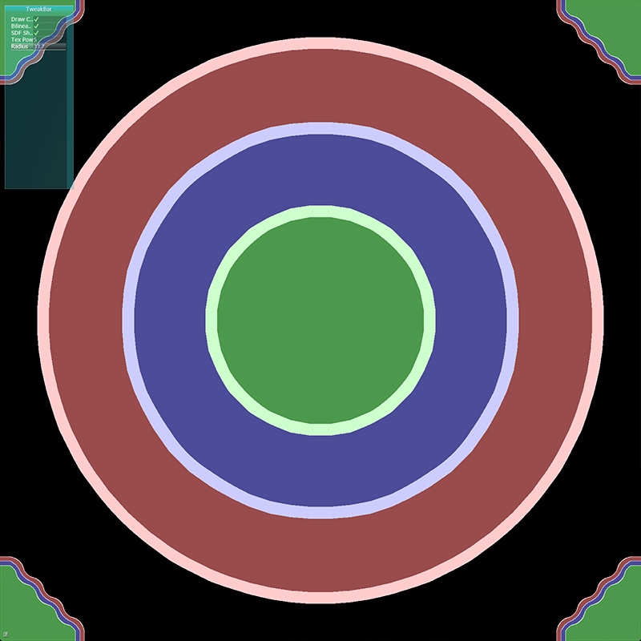

# SDF Rendering Test

This is a test I wrote to experiment with signed distance field rendering. I made SDF functions for a circle and for a square and wrote a shader to shade it at different steps. I noticed that when overflowing the numbers, it made interesting patterns, so I played with animating it a bit.




## Building

GLFW3 and AntTweakBar are required. Binaries for macOS are included in the repo.

The CMake was only tested macOS. The libraries may need to be modified on other platforms.

To build on macOS:
```
mkdir build
cd build
cmake ..
cmake --build . --target install
```

## Controls

Drag with mouse to rotate view. Scroll to zoom in/out.

- *Draw Circle* - toggle between circle/square SDF
- *Bilinear Filter* - toggle bilinear/nearest sampling
- *SDF Shader* - toggle SDF/grayscale shader
- *Tex Pow* - 2^pow factor applied to radius
- *Radius* - the computed radius for the shape function

## Authors

Trevor Smith - [LinkedIn](https://linkedin.com/in/trevorsm/)
